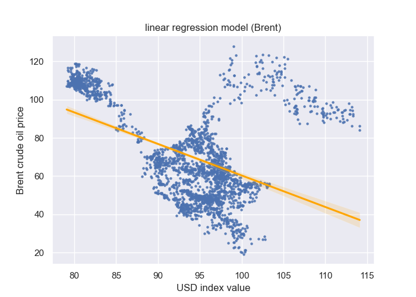
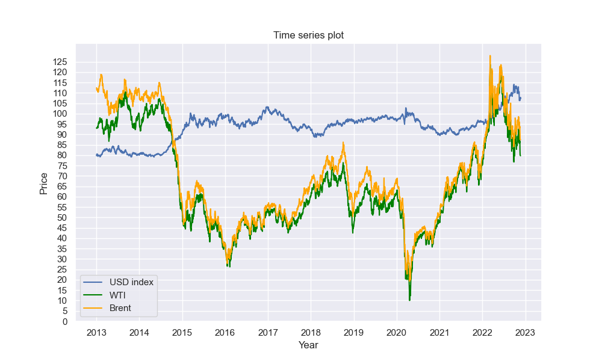
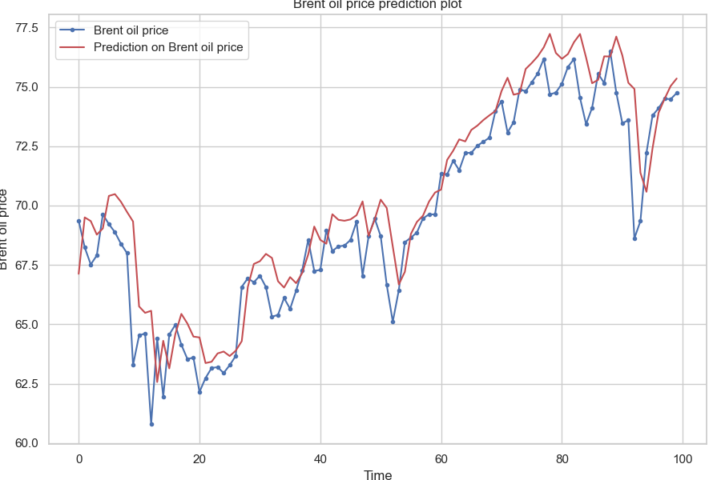
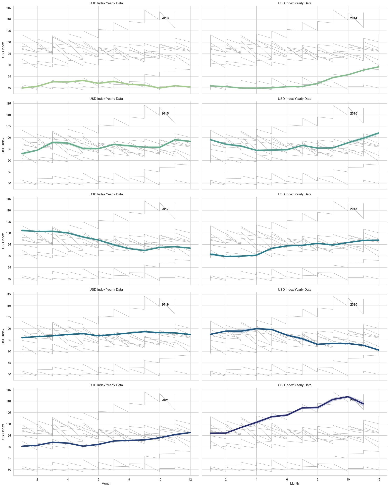

# DSCI510_FinalProject
The name of my final project is "Correlation between the USD value and the crude oil price between 2013-2022". In this project, I intend to explore how US dollar value and oil prices fluctuate over time, whether there is a correlation between them, whether the correlation changed over time, and make predictions on future US dollar values and oil prices. Three data sources are involved in this project: The US dollar index historical dataset, the WTI crude oil stock data, and the Brent crude oil stock data. I would conduct statistical tests, build models, and make visualizations to achieve my research goals. The motivation for my project is to give insights into the economy and financial fields and also help people who are concerned about US dollar values and oil prices to make decisions and set future strategies. 

## How to run the code
a. 
- The full list of all the dependecies installed on my laptop could be seen in the __"requirements_full_list.txt"__ file. The list of the top-level dependencies I mainly used in this project could be seen in the __"requirements.txt"__ file.

- In addition, I also list the top-level denpendecies here for your reference. The language I used in this project is Python, the version of it is "Python 3.9.12". The other dependencies includes "yfinance==0.1.85", "requests==2.27.1", "pandas==1.4.2", "matplotlib==3.5.1", "scipy==1.7.3", "seaborn==0.11.2", "numpy==1.21.5", "plotly==5.6.0", "scikit-learn==1.2.0", "keras==2.11.0", "statsmodels==0.13.2", and "tensorflow==2.9.1". 

- To install the dependencies listed above, you could use pip command or you could even install it manually. If you only want to install the dependencies I listed above, you could run pip command: "pip install -r requirements.txt" in the terminal. 

b. 
- In the 'code' folder, you could reproduce the result by manually running the 'main.py' file. You could also run "python code/main.py" in terminal after you get into this project folder. Before running the code, make sure you have installed all the ddependencies. Since I have included processes of machine learning, running the program would take some time. 

c. 
- __[GitHub repository link](https://github.com/HazelHaorui/DSCI510_FinalProject)__

## Data sources

a. data sources and approaches

- In this project, I collected three data samples from two different sources. The datasets are the USD index historical dataset, the WTI crude oil price dataset, and the Brent crude oil price dataset. 

1. data sources description

- The USD index historical data presents the daily value of US dollars. The USD index is a weighted geometric mean of the dollar's value relative to certain selected currencies, including the Euro, Japanese yen, Pound sterling, Canadian dollar, Swedish krona, and Swiss franc. The USD index data could be found on the [Investing.com](https://www.investing.com/indices/usdollar-historical-data) website. 

- The second and third datasets I collected are both about the crude oil price, which are WTI crude oil price data and Brent crude oil price data. The WTI oil is mainly from Texas and it served as the main benchmark for North America. On the other hand, Brent oil is mainly from Europe, Africa, and the Middle East, which is a global benchmark and a broader indicator of worldwide oil prices. I would include both of them in this project. Both the crude oil price datasets are provided by Yahoo Finance. Here is the website links of these two datasets: [WTI crude oil price](https://finance.yahoo.com/quote/CL%3DF/history?p=CL%3DF) and the [Brent crude oil price](https://finance.yahoo.com/quote/BZ=F?p=BZ=F&.tsrc=fin-srch).

- The time range I set for these three datasets is the same, which is from 2013-01-01 to 2022-11-22. 

2. approaches of collecting data

- To download the USD index historical dataset, I used an [API](http://api.scraperlink.com/investpy/) to scrap the data from the website. According to the API, in order to obtain the data of a specific ticker, we need to reset the parameters in the URL. First, I set the 'email' to my own email address. (After running the code, the API would send an email containing an API key. However, in the whole process of downloading the dataset, the API key was never used.) Second, since I intend to download data from a specific time period, I set the 'type' as 'historical_data', 'from_date' as '2013-01-01', the 'to_date' as '2022-11-22', and the 'time_frame' as 'Daily'. The USD index data belongs to the category of index so the 'product' parameter is set to 'indices'. Finally, according to the name id of the USD index, the 'symbol' parameter is set as 'DXY'. As a result, the data could be accessed by using this URL in code: https://api.scraperlink.com/investpy/?email=nihaorui715@gmail.com&type=historical_data&product=indices&from_date=2013-01-01&to_date=2022-11-22&time_frame=Daily&symbol=DXY.

-  After running the URL link above, the original data is stored in JSON format. It first has a key called 'data'. Under the key 'data', there is a list of dictionaries contain key-value pairs. There are a total of 16 keys, including "direction_color", "rowDate", "rowDateRaw", "rowDateTimestamp", "last_close", "last_open", "last_max", "last_min", "volume", "volumeRaw", "change_precent", "last_closeRaw", "last_openRaw", "last_maxRaw", "last_minRaw", and "change_precentRaw". I collected all these keys and their values. After collecting, I saved the data in both JSON and CSV format("USD_index.json" and "USD_index.csv"). The USD historical index dataset includes a total of 2582 rows of data.

- To download the WTI crude oil price data and the Brent crude oil price data, I used the 'yfiance' package to get access to Yahoo Finance. In the code, I also set parameters to obtain specific tickers. The symbol of WTI crude oil is 'CL=F' and the symbol of Brent crude oil is 'BZ=F'. Therefore, the 'tickers' parameter is set as 'CL=F' for WTI and 'BZ=F' for Brent. To indicate the period of for both datasets, the 'start' parameter is set as '2013-01-01', the 'end' is set as '2022-11-22', and the 'interval' is set as '1d'. 

-  After the downloading, the original data would have the structure of 'pandas.DataFrame'. These two data samples each has a total of 7 variables(columns), including 'Date', 'Open', 'High', 'Low', 'Close', 'Adj Close', and 'Volume'. I saved the WTI crude oil price and the Brent crude oil price in CSV format("tick_wti.csv" and "tick_brent.csv"). The WTI crude oil price dataset and the Brent crude oil price dataset each have 2491 and 2475 rows of data.

3. data preprocessing

- For future analyses and visualizations, I conducted data pre-processing steps. The first step is to drop columns that would not be used in later analyses. In the USD index dataset, I dropped 10 columns. The second step is to check whether there are null values in these three datasets. The results would be in the terminal shown after running the code. According to the results, there is no missing value in the dataset and there is no need to conduct data imputation. The third step is to change the column names to be more interpretable and avoid having the same names after merging the datasets. I changed column 'rowDate' to 'Date', 'Adj Close' in the WTI oil price dataset to 'adj_close_wti', and 'Adj Close' in the Brent oil price dataset to 'adj_close_brent'. The fourth step is deleting data below zero. Since I found that there are some oil prices in WTI crude oil price dataset that are smaller than 0, which I think would be abnormal and should be treated as outliers, I deleted all the rows which contain data below zero. After that, I merge the USD historical index dataset, the WTI crude oil price dataset, and the Brent crude oil price dataset into new datasets through the variable 'Date'. Finally, I resampled the new dataset and created new columns 'Year' and 'Month'.

b. changes and challenges

- I faced a challenge and changed my plan when I was trying to download the USD index historical dataset from the Investing.com website. There are two packages("investpy" and "investiny") that could be used to download the data. However, when I tried to download the data through these packages, it always prompted error messages such as "Error 403. try again later". I finally found out that the packages broke down. After searching, I decided to change to use an API that I found on GitHub to scrap the data. This API is built specifically for the Investing.com website. Moreover, since I am not confident enough about the stability of this API, if this API stop working, the dataset could also be downloaded through the website [Investing.com](https://www.investing.com/indices/usdollar-historical-data). You could just choose the period between 2013-01-01 and 2022-11-22, and click on the download button to obtain the dataset. There would be a CSV file on your local machine after the download is completed.

## Methodology

- In this part, I briefly talked about all the analyses, visualizations, and bonus visualizations I made in this project.

- In the analyses part of this project, I complete a correlation analysis. I first built linear regression models to produce OLS regression results and regression plots. In addition, I calculated each year's correlation coefficient and made a time series line chart on how the correlation coefficient changed from 2013 to 2022. 

- In the visualization part, I tried to find how data fluctuate over time and find correlations through plots. I first drew a time series plot to see how the USD index, WTI crude oil price, and Brent oil price fluctuated over time. Then, I built time series boxplots of the USD index and oil prices. Finally, I built heatmaps for the USD index and the brent oil price. 

- In the advanced analyses and visualization part, I applied the LSTM network to make predictions on future USD index values and oil prices. I also made an interactive time series plot and drew every year's time series plot for the USD index and oil prices. 

## Analyses and Visualizations

a. and b. (I combined question a and question b here.)

- In this part, I would illustrate the visualization methods and the reason why I choose this way of visualizing, describe the figures and explain the setup and elements, and describe the observations and conlusions and the impacts of my findings.

1. Analyses (the code could be seen in analyze_the_data.py)

- In the analyses part, in order to use statistical analysis to find the correlation between the USD index value and oil price from 2013 to 2022, I first built linear regression models. I used the "last_close", "adj_close_wti", and "adj_close_brent" three variables in the dataset to complete the analysis. The "last_close" represents the USD index data, the "adj_close_wti" represents WTI crude oil price, and the "adj_close_brent" represents the Brent oil price. I applied the module 'statsmodels' to produce the OLS regression result and used the module 'seaborn' with the "replot()" function to draw linear regression plots. The reason why I choose to produce the OLS regression result is that it would provide statistical values which could help us to explore correlation and the linear regression plot would help to visualize the relationship between the USD index and oil price.

- The OLS regression results are shown in the figures below. The first image is the result between the USD index value and the WTI crude oil price. The second is the result between the USD index value and the Brent crude oil price. The followings are some important statistical value provided in the results that I think is meaningful in this research. In this research, the USD index value is the independent variable and the WTI crude oil price and the Brent crude oil price are dependent variables. In the results, the "P>|t|" indicates the p-value. In both images, we could see that the p-value is 0.000. It means that the p-value is really close to zero. Since the common threshold set for p-value is 0.05, the results indicate that we are confident to reject the null hypothesis and that the correlation between the USD index and oil price is statistically significant. In addition, the 'Prob(F-Statistic)' tells the overall significance of the regression. When Prob(F-Statistic) is close to zero, it means the overall regression is meaningful. From the figures, we could tell that both Prob(F-Statistic) values, which are 6.38e-127 and 4.99e-143, are all close to zero. Moreover, the coefficient term in the image represents the change in oil price when the USD index change by one unit. We could see that when the USD index value increases by one unit, the WTI crude oil price would drop by 1.4599, and the Brent crude oil price would drop by 1.6481. The coefficient term would illustrate that there might be a negative relationship between USD index and oil price. The R-squared value help to evaluate how well the model explains the data. It measures the percentage variation in dependent that is explained by independent variables. In the figures, the R-squared values are 0.207 and 0.231, which is not big enough and claims that the model did not fit the data well.

- After that, I made the result visualized by drawing regression model plots. The first plot presents the regression between the USD index value and WTI oil price. The second one is between the USD index value and Brent oil price. The scattered part of the plot indicates the value of the independent variable(USD index) and the dependent variables(WTI oil price and Brent oil price). The line represents the relationship of the variables after regression. Both regression lines in the figures indicate that when the USD index value increase, the oil price would drop, which represents a negative correlation.

- From the OLS regression results and the linear regression plots above, we could say that there is a great chance that the USD index value and the oil price have a negative correlation. Moreover, from the p-value and Prob(F-statistic) values, we are confident to reject the null hypothesis and our results are statistically significant. However, there are only 20.7% of the data on WTI oil price and 23.1% of the data on Brent oil price are explained by the USD index values. It claims that the model did not fit the data well enough and should be improved in future work.

- Finally, I drew line plots about every year's correlation coefficient between the USD index and the oil price to explore how the correlation changed in the past ten years. By applying the "scipy" package and using the "scipy.stats.pearsonr()" function, I could get the result of the Pearson correlation coefficient. Based on the 'Year' variable in the dataset, I calculated each year's correlation coefficient and saved the data in the "cor_year_wti.csv" and "cor_year_brent.csv" files. Based on the CSV files, I applied the "matplotlib" module to draw line charts.

- The first figure is every year's correlation coefficient line chart between the USD index and the WTI oil price. The second figure is between the USD index and the Brent oil price. The lines describe each year's correlation coefficient from 2013 to 2022. The x-axis represents the year and the y-axis represents the correlation coefficient. The plot of WTI is very similar to Brent, we could say that WTI and Brent oil price has the same correlation with the USD index value. From the plot, we could also tell that in most of the years between 2013 to 2022, the correlation coefficient is below 0, meaning that they have a negative correlation. However, from 2020 to 2022, the correlation coefficient increased a lot. The peak is even higher than 0.5. The correlation between the USD index value and oil price turned positive during that period. In conclusion, we could say that the correlation between the USD index and oil price is negative most of the time while it has had a positive trend in the recent two years.

- From the analyses I completed above, we have concluded that the USD index and the oil price have a negative correlation most of the time from 2013 to 2022. However, the correlation started to turn out to be positive in recent two years. I think this conclusion might give some insights into financial markets to help make predictions on future USD index and oil prices and also help to make decisions for the current world economy. 

2. Visualization(the code could be seen in generate_visualization.py)

- In the visualization part, in order to see how the USD index, WTI crude oil price, and Brent oil price fluctuated over time, I applied the "matplotlib" module and used the "last_close"(USD index value), "adj_close_wti"(WTI crude oil price), "adj_close_brent"(Brent crude oil price), and "Date" variables to draw a time series plot. I added labels, titles, and curve colors to present information. The title of the plot is 'Time series plot'. From the plot, we could see that there are three curves presenting data over time series. The labels of different curves are listed at the left bottom of the figure. The blue curve represents the USD index value, the green curve represents the WTI oil price and the orange curve represents the Brent oil price data. The x-axis is the 'Date' and the y-axis represents the USD index or oil prices.

- According to the plot, we could draw many conclusion about how data fluctuate over time. For example, we could see that the WTI oil price curves and Brent oil price curves fluctuate very much the same. The USD index value curve does not fluctuate as much as the other two oil price curves. In most of the time of the years 2013, 2014, and 2022, the oil prices are higher than the USD index value, and in the other years, the oil prices are lower than the USD index value. It is also obvious that the oil price dropped sharply in 2014 and increased a lot in 2020 and 2021. 

- From the time series plot, it is very hard to tell the correlation between the USD index value and oil price. However, the correlation could be obviously presented in boxplots. Therefore, I created the time series boxplot as shown below. To create this boxplot, I applied the "matplotlib" module and "seaborn" module with the "sns.boxplot()" function and used the "last_close", "adj_close_wti", "adj_close_brent", and "Year" variables. The boxplot contains each year’s boxplot and is placed in time series. Each small boxplot displays the statistical numbers including minimum, first quartile, median, third quartile, and maximum. The x-axis represents the year of the boxplots and the y-axis represents the USD index, the WTI oil price, or the Brent oil price.

- According to the boxplot, we could see that the WTI oil price and the Brent oil price are almost the same. However, except for the period from 2021 to 2022, the USD index value fluctuated in the opposite way from the WTI oil price and Brent oil price. When the USD index value increase, the oil price would drop. This also indicates a negative correlation. In the period between 2021 to 2022, when the USD index value increased, the oil price also increased, which indicates a positive correlation. From this boxplot, we could also draw a conclusion that the correlation between the USD index and oil price was negative in the past but started to turn to be positive in recent years. These findings are similar to the correlation coefficient plots shown above.

- In addition, I also included heat maps to explore the fluctuation of the USD index and oil prices in a more intuitionistic way. We could also make comparisons between the heatmap to explore correlation. Since from the above we already know that the WTI crude oil price data is very much the same as the Brent oil price data, I choose to only include Brent oil price data in this visualization. I applied the "seaborn" module with the function "sns.heatmap()" to create the heatmaps. Each of the small boxes of the heatmap contains the USD index value or the oil price of that month. I kept the values in the boxes to two decimal places. According to the background color of the box, the larger the value, the darker the color of the box, and vice versa. The x-axis represents the year and the y-axis represents the month.

- From these two heat maps, we could clearly see the increment and decrement of the USD index value and Brent oil price from 2013 to 2022. For example, we could tell that the background color of the USD index is light-colored in 2013 and 2014, which illustrates the USD index value was quite low in 2013 and 2014. However, this year’s USD index value color is darker which means the value is higher. We could also tell that the background color of the oil price in 2013 and 2014 is really dark, which indicates the oil price was higher in these two years. According to the background color of the heatmaps, we could also find that the correlation between the USD index value and the oil price was first negative and then became more positive.

- Based on the visualizations I completed above, we could tell how the USD index data and oil prices changed over time. We also drew the same conclusion that the correlation between the USD index and oil price was negative while it became more positive in the recent two years. I think these plots could provide some insights to experts in economic or political areas to find out what kinds of world situations might have an influence on the increment or decrement of the USD index and oil prices and also obtain knowledge and experience for the future. By using the knowledge from other fields, we could also make more analysis on why the correlation changed from negative to positive, which would be a huge contribution to the economy and finance world. Moreover, knowing how the USD index value and oil price fluctuate over time and the correlation between them could help people who are concerned about USD value and oil price to make decisions. 

__[Bonus Analyses and Visualizations]__

- The first advanced analysis I tried to complete is to make predictions on the USD index value and oil price. I referenced the code of an [example](https://www.kaggle.com/code/mahmoud87hassan/predict-future-crude-oil-prices-using-lstm-network/notebook) and modified it to make predictions on my datasets. The prediction of the USD index and oil price is never an easy job since they could be influenced by many different factors, such as the world situation, economy, financial markets, etc. In this project, I only completed a simple model to make predictions. In the prediction process, I imported "tensorflow" and "keras" packages to build the LSTM network and use the "last_close"(USD index data), "adj_close_brent"(Brent oil price data), and "Date" variables to train and test the model. The reason why I used LSTM neural network is that LSTM is very powerful when predicting stock prices. The future USD index and oil price depend on the previous value and the LSTM has the ability to store and utilize previous data. Therefore, I finally chose LSTM to complete the prediction analysis. In this analysis, I also did not include the WTI oil price data and only use the Brent oil price data. In the process of training and testing, I set the 'epochs' to 200, which represents the number of iterations. The batch size is set as 32. I also set the training set as 80% of the data and the test set as 20%.

- In addition, I also imported the "scikit-learn" module to calculate the mean absolute error to evaluate the model. In the USD index prediction process, the train mean absolute error is about 0.183 and the test mean absolute error is about 0.182. In the oil price prediction process, the train mean absolute error is about 2.591 and the test mean absolute error is about 9.019. The MAE might differ in each run but the value won't change a lot. The MAE measures the absolute difference between the actual data and prediction data. A small MAE indicates that the model would make a great prediction and a big MAE means that the prediction results produced by the model are not accurate enough. From the values above, we could tell that the USD index prediction model did a good job while the oil price prediction model is not very accurate when making predictions. 

- The two figures below are the prediction results of the models. The first figure is the prediction of the USD index value. There are two curves in the plot, the blue one is the actual data, and the red one is the prediction data. The x-axis is the time step and the y-axis is the value of the USD index. The second plot is the prediction on Brent oil price and the elements presented in the figure have the same meaning. From these two plots, we could see that there are differences between the prediction value curve and the actual value curve. However, as a whole, I think the trends of the curves are very similar and the differences are not that huge. Therefore, I think these two models could make some reasonable predictions for the future USD index and oil prices.

- The reason why I build this prediction model and consider it as a advanced analysis is that I think this would have meaningful impacts. For people who have much concerned about the USD index value or the oil price, making predictions would help them make decisions for the future. These would also help people in the economic or political field to set strategies.

- The second advanced visualization I made is an interactive time series plot. The plot could be seen by opening the "slider.html" file in the browser. You could also see the whole interactive process through the video. This plot is based on the time series plot above and added some interactive functions. I referenced an [example](https://plotly.com/python/range-slider/) provided by the "plotly" library. In the plot, when you hover the mouse over any part of the curves, it would display the curve labels and the year and month of that data point. On the left top side of the plot, it has 5 buttons, which are "1m", "6m", "YTD", "1y", and "all". By clicking on the buttons, users could choose the time range they want. Moreover, there is a slider at the bottom of the plot. Through this slider, users could select any time period by pulling the slider.

- From this interactive time series plot, the basic findings and conclusions are the same as the time series plot above. However, in this interactive plot, I think people could explore the fluctuations in USD index data and oil price data in a clearer way. They could choose any time period they intend to observe and obtain the information more comprehensively.
 

- Finally, I also made every year time series plots on the USD index and oil price. In this visualization, I referenced the [example](https://seaborn.pydata.org/examples/timeseries_facets.html) provided by the "seaborn" library. The plots divided the data by year and presented each year's USD index data and oil price data over time. I also did not include WTI oil price and only used Brent oil price data in this visualization. The first plot below describes each year's USD index value with the background of the curves from all the other years. The year of the plot is indicated at the right top of the plot. The x-axis represents the date and the y-axis represents the USD index value. Same thing with the Brent oil price plot. From these plots, people could easily make comparisons between each year's curve and other years' curves. For example, it is very obvious that the USD index value increased sharply this year, especially in October. We could also tell that the overall price of oil this year is higher than in previous years.

- The findings and conclusions of these plots are also about the increment and decrement of the USD index value and oil price over time. However, in these plots, people could observe each year’s fluctuations and make comparisons, which I think would present more meaningful information.

c. changes and challenges

- I faced a challenge when making predictions on the USD index and the oil price. At first, the difference between the predicted curve and the actual curve was huge, which means the model is not able to make predictions. In order to improve the accuracy, I changed the size of the training data and test data. I also increase the iteration number and set the batch size to 32. After resetting the parameters in the code, the accuracy improved a lot. 

## Future Work
- If I could be given more time to work on this project, the first thing I would do is create visualizations that could draw conclusions from different perspectives. The previous visualizations I made are all about observing the fluctuation of data over time and exploring the correlation between the USD index and crude oil price. If possible, I intend to explore more meaningful visualizations that could have better presentations. 

- The second improvement I intend to complete is to improve the accuracy of the prediction model. From the above, the model for the prediction of oil price does not present a high-quality performance. I could include other methods or algorithms to build prediction models and make comparisons between these models to choose the one that has the best performance. Moreover, since the USD index value has a correlation with the oil price, I should also combine these two variables to make predictions.
 

