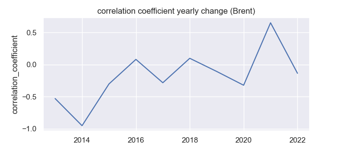

# DSCI510_FinalProject
The name of my final project is "Correlation between the USD value and the crude oil price between 2013-2022". In this project, I intend to explore how dollar value and oil prices fluctuate over time, whether there is a correlation between them, and whether the correlation changed over time. There are three data sources involved in this proejct: The US dollar index historical dataset, the WTI crude oil stock data, and the Brent crude oil stock data. To achive my research goal, I would use statistical methods and make visualizations.
## How to run the code
a. 
- The full list of all the dependecies installed on my laptop could be seen in the __"requirements.txt"__ file. 

- The denpendecies I mainly used in this project are as follows. The main language I used in this project is Python, the version of it is "Python 3.9.12". The package I used for downloading data from website is "yfinance==0.1.85". Other packages, modules, and libraries include "requests", "pandas==1.4.2", "json", "csv", "matplotlib-venn==0.11.7", "scipy", "seaborn", "numpy", "statsmodels", "os", "kaleido==0.2.1", and "plotly". 

b. 
- In the 'code' folder, you could reproduce the result by running the 'main.py' file. Before running the code, make sure you have installed all the ddependencies. 

c. 
- __[GitHub repository link](https://github.com/HazelHaorui/DSCI510_FinalProject)__

## Data sources
a. data sources and approaches

In this project, I collected three datasets from two different sources. The datasets are the USD index historical dataset, the WTI crude oil price dataset, and the Brent crude oil price dataset. 

1. data sources description

- The USD index historical data presents the daily value of US dollars. The USD index is a weighted geometric mean of the dollar's value relative to certain selected currencies, including the Euro, Japanese yen, Pound sterling, Canadian dollar, Swedish krona, and Swiss franc. The USD index data could be found on the [Investing.com](https://www.investing.com/indices/usdollar-historical-data) website. 

- The second and third datasets I collected are both about the crude oil price, which are WTI crude oil price data and Brent crude oil price data. The WTI oil is mainly from Texas and it served as the main benchmark for North America. On the other hand, Brent oil is mainly from Europe, Africa, and the Middle East, which is a global benchmark and a broader indicator of worldwide oil prices. I would include both of them in this project. Both the crude oil price datasets are provided by Yahoo Finance. Here is the website links of these two datasets: [WTI crude oil price](https://finance.yahoo.com/quote/CL%3DF/history?p=CL%3DF) and the [Brent crude oil price](https://finance.yahoo.com/quote/BZ=F?p=BZ=F&.tsrc=fin-srch).

- The time range I set for these three data samples is the same, which is from 2013-01-01 to 2022-11-22. 

2. approaches about collecting data

- To download the USD index historical dataset, I used an [API](http://api.scraperlink.com/investpy/) to scrap the data from the website. According to the API, in order to obtain the data of specific ticker, we need to reset the parameters in the URL. First, I set the 'email' to my own email address. (After running the code, the API would send an email containing an API key. However, in the whole progress of downloading the dataset, the API key was never used.) Second, since I intend to download data from a specific time period, I set the 'type' as 'historical_data', 'from_date' as '2013-01-01', the 'to_date' as '2022-11-22', and the 'time_frame' set as 'Daily'. The USD index data belongs to the category of index so the 'product' parameter is set to 'indices'. Finally, according to the name id of the USD index, the 'symbol' parameter is set as 'DXY'. As a result, the data could be accessed by using this URL: https://api.scraperlink.com/investpy/?email=nihaorui715@gmail.com&type=historical_data&product=indices&from_date=2013-01-01&to_date=2022-11-22&time_frame=Daily&symbol=DXY.

-  After running the URL link above, the original data is stored in JSON format. It first has a key called 'data'. Under the key 'data', there is a list of dictionaries contain key-value pairs. There are a total of 16 keys, including "direction_color", "rowDate", "rowDateRaw", "rowDateTimestamp", "last_close", "last_open", "last_max", "last_min", "volume", "volumeRaw", "change_precent", "last_closeRaw", "last_openRaw", "last_maxRaw", "last_minRaw", and "change_precentRaw". I collected all these keys and their values. After collecting, I saved the data in both JSON and CSV format. The USD historical index dataset includes a total of 2582 rows of data.

- To download the WTI crude oil price data and the Brent crude oil price data, I used the 'yfiance' package to get access to Yahoo Finance. In the code, I also set parameters to obtain specific tickers. The symbol of WTI crude oil is 'CL=F' and the symbol of Brent crude oil is 'BZ=F'. Therefore, the 'tickers' parameter is set as 'CL=F' for WTI and 'BZ=F' for Brent. To indicate the period of for both datasets, the 'start' is set as '2013-01-01', the 'end' is set as '2022-11-22', and the 'interval' is set as '1d'. 

-  After the downloading, the original data would have the structure of 'pandas.DataFrame'. These two data samples each has a total of 7 variables(columns), including 'Date', 'Open', 'High', 'Low', 'Close', 'Adj Close', and 'Volume'. I saved the WTI crude oil price and the Brent crude oil price in CSV format. The WTI crude oil price dataset and the Brent crude oil price dataset each have 2491 and 2475 rows of data.

3. data preprocessing

- For future analyse and visualizations, I conducted data pre-processing steps. The first step is to drop columns which would not be used in later analyses. In the USD index dataset, I dropped 10 columns. The second step is to check whether there is null values in these three datasets. The results are that there are no missing value in the dataset and there is no need to conduct data imputation. The third step is to change column name to more interpretable and avoid having same column names after later merge the datasets. I changed column 'rowDate' to 'Date', 'Adj Close' in WTI oil price dataset to 'adj_close_wti', and 'Adj Close' in Brent oil price dataset to 'adj_close_brent'. The fourth step is deleting data below zero. Since I found that there are some oil prices in WTI crude oil price dataset are smaller than 0, which I think would be abnormal and should be treated as outliers, I deleted all the rows which contain data below zero. After that, I merge the USD historical index dataset, the WTI crude oil price dataset, and the Brent crude oil price dataset into a new dataset through the variable 'Date'. Finally, I resampled the new dataset and created new columns 'Year' and 'Month', which indicates the year and month of that piece of data.

## Analyses and Visualizations

a.

1. Analyses

- In the analyses part of this project, I complete a correlation analysis. I first built linear regression models to find the relationship between the USD index and crude oil price. By using a python module "statsmodel", I obtained the "OLS Regression Results", which include statistical values such as p-value, coefficient term, standard error, etc. Moreover, I also drew regression plots using "Seaborn". In addition, I calculated each year's correlation coefficient and made a time series line chart on how the correlation coefficient changed from 2013 to 2022. I finally found that the correlation between the USD index and the oil price was negative in the past while it seems to be more positive now. 

- The first analysis I made is building the linear regression model. The followings are the OLS regression results. The first image is the result between the USD index value and the WTI crude oil price. The second is the result between the USD index value and the Brent crude oil price. The USD index value is the independent variable and the WTI crude oil price and the Brent crude oil price are dependent variables. In the results, the "P>|t|" indicates the p-value. In both images, we could see that the p-value is 0.000. It does not mean that the p-value equals 0.000, it represents that we are confident to reject the null hypothesis and that the correlation between the USD index and oil price is statistically significant. Moreover, the coefficient term in the image represents the change in oil price when the USD index change by one unit. We could see that when the USD index value increases by one unit, the WTI crude oil price would drop by 1.4599, and the Brent crude oil price would drop by 1.6481. From the results, it is very likely that the USD index and oil price have a negative correlation.

- After that, I also built linear regression plots based on the results above. The first plot is the linear regression model between the USD index value and WTI oil price. The second one is between the USD index value and Brent oil price. From the lines of the plots, we could tell that the USD index value is having a negative relationship with the oil price.

- Finally, in the analyses part, I calculated each year's correlation coefficient between the USD index and oil price. I saved the data in the "cor_year_wti.csv" and "cor_year_brent.csv" files in the result folder. Based on the CSV files, I drew line charts on how the correlation coefficient changed from 2013 to 2022. The charts of WTI and Brent are very similar to each other. From the plot, we could tell that in most of the years between 2013 to 2022, the correlation coefficient is below 0, meaning that they have a negative relationship. However, from 2020 to 2022 the correlation coefficient increased a lot. The peak is even higher than 0.5. The correlation between the USD index value and oil price might turn positive during the period from 2020 to 2022.

2. Visualizations

- In the visualization part, I tried to find how data fluctuate over time and find correlation through plots. I first drew a time series plot to see how the USD index, WTI crude oil price, and Brent oil price fluctuated over time. Then, I built boxplots of the USD index and oil prices. The boxplots clearly show the the statistical number including minimum, first quartile, median, third quartile, and maximum in each year and we could also see the correlation between the USD index and the oil price. Finally, I also built heatmaps for the USD index and the oil price to see how the data changed and make comparisons between them. 

- First, I made a time series plot that describes how the USD index value, the WTI crude oil price, and the Brent crude oil price fluctuated over time. From the plot, we could see that the WTI oil price and Brent oil price curves fluctuate very much the same. The USD index value curve does not fluctuate as much as the other two oil price curves.

- Besides the basic time series plot, I also made an interactive time series plot. The plot could be seen in the folder 'result' which named "slider.html". By clicking the file, the plot would appear in the browser. This plot is based on the time series plot above and added some interactive functions. In the plot, when you hover the mouse over any part of the curves, it would display the curve label and the date under that time spot. On the left top side of the plot, it has 5 buttons, which are "1m", "6m", "YTD", "1y", and "all". By clicking on the buttons, users could choose any time range they want. Moreover, there is a slider at the bottom of the plot. Through this slider, users could select any time period by pulling the slider. From this interactive time series plot, users could observe data and find correlations in any time range. The plot also shows all the data in a clearer way. 

- From the time series plot, it is very hard to tell the correlation between the USD index value and oil price. However, I think the correlation is more obvious in a boxplot through time series. The boxplot contains each year’s boxplot and is placed in time series. Each small boxplot displays the statistical number including minimum, first quartile, median, third quartile, and maximum. In the boxplot, we could see that the WTI oil price and the Brent oil price are almost the same. However, except for the period from 2021 to 2022, the USD index value fluctuated in the opposite way from the WTI oil price and Brent oil price. When the USD index value increase, the oil price would drop. This also indicates a negative correlation. In the period between 2021 to 2022, the correlation seems to be positive. All these findings are similar to the correlation coefficient plots above.

- In addition, I also included three heatmaps of the USD index value, the WTI oil price, and the Brent oil price. From the heatmap, we could see the increment and decrement of the value more intuitionistic. According to the shade of the color, we could also find that the correlation between the USD index value and the oil price was first negative and then became more positive.

- Finally, I made three every-year plots. By using the data of the USD index value, the WTI oil price, and the brent oil price, I drew time series plots for each year. The first plot describes each year's USD index value fluctuation with the background of the curves from all the other years. Same thing with the other two plots, which describe the WTI oil price and the Brent oil price. From these three plots, people could easily make comparisons between each year's curve and other years' curves. For example, it is very obvious that the USD index value increased sharply this year, especially in October. Moreover, by using these plots, we could also compare the USD index value with oil price by year.

